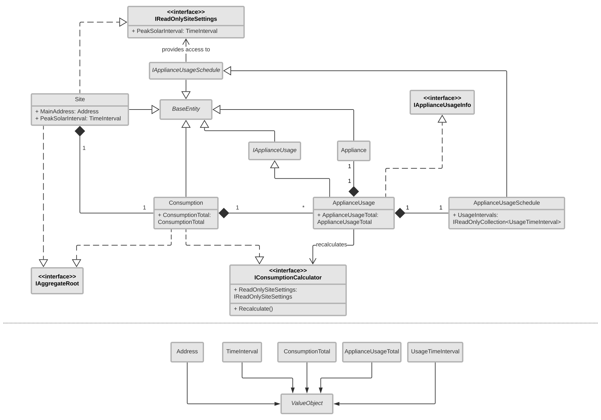

# SolarTally (WIP Under Development!)

An open-source app to tally electricity needs and solar equipment costs for 
off-grid solar setups.

## Key technologies

* ASP .NET Core 3 with EF Core 3
* Angular 8

## UML Diagram for Domain objects

Here is an analysis level UML class diagram hiding most of the specifics.

## Configuring Secrets for Development enviroment

When working in the Development environment, I use the
[Secret Manager tool](https://docs.microsoft.com/en-us/aspnet/core/security/app-secrets?view=aspnetcore-3.0&tabs=linux#secret-manager)
to configure user secrets in the connection strings.

Since we're using postgres for our database, I've assigned the secret id to be
`postgres` (but perhaps later I can generalize this).

In order to configure the secrets on your machine, you should:

1. `cd src/SolarTally.WebUI_Ng`
2. `dotnet user-secrets init --id postgres`
   
   Unless you've already used the `postgres` id for a previous project, this
   will create an empty `secrets.json` under
   [`{user_secrets_path}`/](https://docs.microsoft.com/en-us/aspnet/core/security/app-secrets?view=aspnetcore-3.0&tabs=windows#how-the-secret-manager-tool-works)`postgres`.
   
   It normally also adds a `<UserSecretsId>postgres</UserSecretsId>` to the
   csproj, but in our case the `SolarTally.WebUI_Ng.csproj` already has this
   attribute.
   
   Nevertheless, depending on your platform, it might cause some harmless
   formatting changes to the csproj xml, which *should* be ok to commit.
3. `dotnet user-secrets set "PostgresUsername" "YOUR_POSTGRES_USERNAME"`
4. `dotnet user-secrets set "PostgresPassword" "YOUR_POSTGRES_PASSWORD"`

Now the secrets can be accessed from both the WebUI_Ng and Persistence projects.

## Migrations

Migrations stuff is done using the `dotnet ef` command
in the `SolarTally.Persistence` project folder. In order to access connection
strings, the `--startup-project` must be the path to the 
`SolarTally.WebUI_Ng.csproj`.

### Removing migrations

`dotnet ef migrations remove --project SolarTally.Persistence.csproj  --startup-project ../SolarTally.WebUI_Ng/SolarTally.WebUI_Ng.csproj`

### Initiating migrations

`dotnet ef migrations add InitialCreate --project SolarTally.Persistence.csproj --startup-project ../SolarTally.WebUI_Ng/SolarTally.WebUI_Ng.csproj`

### Applying migrations

`dotnet ef database update --project SolarTally.Persistence.csproj  --startup-project ../SolarTally.WebUI_Ng/SolarTally.WebUI_Ng.csproj`

## Deployment Notes (Unstable/Rapidly Evolving)

For initial testing of deployment I decided to use Azure App Service to host the app and ElephantSQL for PostgreSQL hosting.

Azure App Service is turning out to be way more painful than I thought. Here are some notes.

### Continuous Deployment

I decided to use Azure Pipelines (Preview) for deploying from Github, because Kudu wouldn't even get past the build stage. But this was before I resolved the 500 errors from the api endpoints, so maybe I should disconnect pipelines and retry with Kudu.

### 500 due to Connection String troubles

This was painful. I was just getting the 500 error for my api. I checked that a simple WeatherForecasts endpoint was working so the issue couldn't be that the app wasn't running at all. Had to most likely be the database.

Here is what I had done when setting up the app: I set the connection string in Azure to reflect the connection details of the ElephantSQL instance, set the type to `PostgreSQL` (this turned out to be the problem!) and then setup the `PostgresUsername` and `PostgresPassword` in the Key Vault in Azure.

Log Streaming wasn't too helpful. Then I tried going into the `scm`, bringing up a powershell and `dotnet SolarTally.WebUI_Ng.dll`. That told me that the `Migrate()` in the custom seed call wasn't sitting well with the platform. So I disabled it. That error went away - now running `dotnet` on the dll would say app was running at localhost:5000.

Of course the api was still 500ing in the browser.

I read that some people altered the web.config, removing `V2` from `modules="AspNetCoreModuleV2"` and the `hosting="inprocess"` attribute. Tried that to no avail.

To get some more insight I enabled `Application Insights` in the app service, and then turned on `Collection Level`, `Snapshot Debugger` and `SQL Commands` under the `Instrument your application` > `.NET Core` tab. I headed over to the freshly baked `Application Insights` resource for my app and noticed this exception in the logs for the 500 errors:

`Npgsql.NpgsqlException (0x80004005): Exception while connecting ---> System.Net.Internals.SocketExceptionFactory+ExtendedSocketException (10013): An attempt was made to access a socket in a way forbidden by its access permissions. 127.0.0.1:5432`.

Which made me realize that the connection string params were never actually being replaced by the ElephantSQL details. Nice.

What to do? Switch the connection string type from `PostgreSQL` to `Custom`. Because, of course. Anyway that worked.

### Loading the SPA

Another issue was that I was unable to load the Angular SPA. I wasn't really sure what was wrong. I could see the `Client/dist` folder in the `wwwroot`.

Finally what worked was changing the `dist/solar-tally` to simply `dist` in the `outputPath` build option in the  angular.json.

## Architectural Concerns

### Monolithic Architecture

This app (inclusive of all the different projects in the solution) has a 
[monolithic architecture](https://docs.microsoft.com/en-us/dotnet/architecture/modern-web-apps-azure/common-web-application-architectures),
as opposed to, say, a [microservices architecture](https://azure.microsoft.com/en-us/blog/microservices-an-application-revolution-powered-by-the-cloud).

There are quite a few pros and cons of each architecural style.
* The monolithic architecture is considerably simpler and faster to develop than
  the microservices architecture.
* On the other hand, the microservices architecture offers much greater and much
  more granular scalability.

### Domain-Driven Design or DDD

The entire architecure tries to adhere to the Domain-Driven design or DDD. In
DDD, the Core layers contain:
* a representation of business-wide entities at the foundation of the entire
  project, called the Domain layer, and
* the surrounding application-wide logic for interfacing with those entities,
  called the Application layer

Specific technologies for Persistence and Web access must adhere to the
data + logic imposed by the Core layers. But the Core layers must not rely on
anything implemented in the Persistence and Web layers.

In fact, I feel like a stronger adherent would make sure that Core does not rely
on the specific technologies used in Persistence and Web. That would make it
easy to swap out different ORMs etc. So, for example, you should not have the
Domain or Application referencing, say, EF Core, because that is an ORM that
deals with Persistence. Anyway, maybe that's too ignorant of the vastly more
common cases.

## Resources

Here were some resources I referenced when making the app.

#### Julie Lerman

* YouTube
  * [Mapping DDD Domain Models with EF Core 2.1 @ Update Conference Prague 2018
  ](https://youtu.be/Z62cbp61Bb8)

#### Jason Taylor

* Github
  * [NorthwindTraders](https://github.com/JasonGT/NorthwindTraders)

* YouTube
  * [Clean Architecture with ASP.NET Core 2.2](https://youtu.be/Zygw4UAxCdg)

#### Steve Smith

* Github
  * [eShopOnWeb](https://github.com/dotnet-architecture/eShopOnWeb)

* YouTube
  * [Tour of Microsoft's Reference ASP NET Core App eShopOnWeb
  ](https://www.youtube.com/watch?v=rSpF1s8wcyA)
